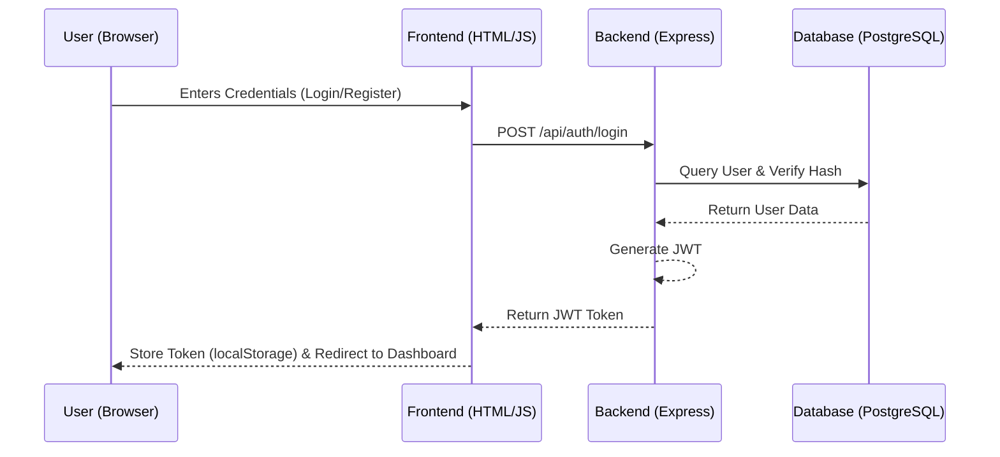
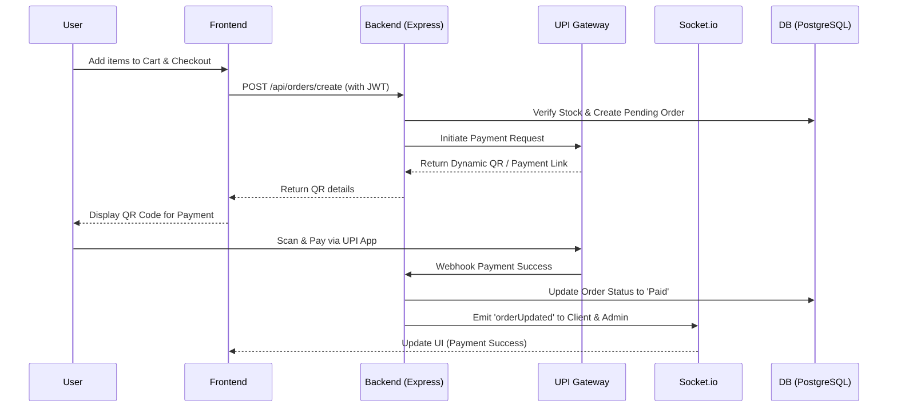
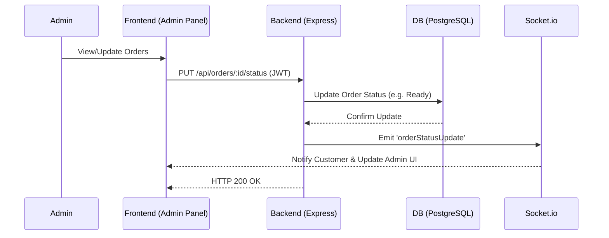

# SRI CUMIN SEEDS CATERING SERVICES - Project Architecture & Plan

## 1. Project Overview

The SRI CUMIN SEEDS CATERING SERVICES is a modern, real-time food ordering system tailored for educational institutions. The system provides an end-to-end flow from user registration and menu browsing, to real-time order placement with UPI dynamic QR code payments, order pickup via QR code verification, and an administrative panel for overall management.

### Key Features
- **Real-time Order Management:** Uses Socket.io for immediate updates between the frontend and backend.
- **Authentication:** JWT-based secure authentication mechanism.
- **Payments:** Integrated UPI Gateway for generating dynamic QR codes.
- **Verification:** Secure QR code-based verification during order pickup.
- **Administrative Control:** Dedicated dashboard to manage menus, track inventory (stock), process orders, and view sales analytics.
- **Email Notifications:** Email-based communication for password resets and user registration.

---

## 2. Technology Stack

### Backend Layer
- **Environment:** Node.js (v18+)
- **Framework:** Express.js (`^5.2.1`)
- **Real-time Communication:** Socket.io (`^4.8.3`)
- **Security & Authentication:** 
  - `bcrypt` (`^6.0.0`) for password hashing.
  - `jsonwebtoken` (`^9.0.3`) for stateless API authentication.
  - `cors` (`^2.8.6`) for cross-origin request handling.
- **Database Driver:** `pg` (`^8.11.0`) for PostgreSQL interactions.
- **Email Service:** `nodemailer` (`^9.0.5`) and `@emailjs/nodejs` (`^5.0.2`).
- **Other Utilities:** `qrcode` (`^1.5.4`), `axios` (`^1.18.1`), `dotenv` (`^17.4.2`).

### Frontend Layer
- **Architecture:** Traditional Multi-Page Application (MPA).
- **Technologies:** Vanilla HTML5, CSS3, JavaScript (ES6+).
- **Structure:** Modularized CSS and JavaScript files residing within `css/` and `js/` directories respectively.

### Database Layer
- **System:** PostgreSQL
- **Connection:** Managed via `DATABASE_URL` for secure and scalable cloud deployment.

### Hosting & Deployment
- **Platform:** Render (Defined via `render.yaml`)
- **Environment:** Node environment.

---

## 3. System Architecture & Directory Structure

```text
canteen/
├── backend/                  # Server-side logic
│   ├── server.js             # Main entry point for Express app and API routing
│   └── database.js           # PostgreSQL connection and queries setup
├── frontend/                 # Client-side assets
│   ├── css/                  # Stylesheets
│   ├── js/                   # Client-side scripts (e.g., app.js)
│   ├── index.html            # Landing page
│   ├── login.html            # User Authentication
│   ├── register.html         # User Registration
│   ├── forgot-password.html  # Password Recovery
│   ├── reset-password.html   # Password Reset
│   ├── menu.html             # Customer Menu & Ordering
│   ├── orders.html           # Customer Order History
│   ├── admin.html            # Admin Dashboard (Overview)
│   ├── admin-menu.html       # Admin Menu Management
│   ├── admin-stats.html      # Admin Sales Analytics
│   ├── edit-menu.html        # Admin Interface for editing items
│   ├── contact.html          # Contact Information Page
│   ├── privacy.html          # Privacy Policy
│   ├── terms.html            # Terms of Service
│   └── refunds.html          # Refund Policy
├── .env                      # Environment Variables Configuration (Not committed)
├── package.json              # Node.js dependencies and scripts
└── render.yaml               # Deployment Configuration for Render
```

---

## 4. API Endpoints Plan

### Authentication & User Management
- `POST /api/auth/register` - Registers a new user.
- `POST /api/auth/login` - Authenticates a user and returns a JWT.
- `POST /api/auth/forgot-password` - Initiates password reset via email.

### Menu & Inventory Management (Admin Protected)
- `GET /api/items` - Retrieves all available menu items.
- `POST /api/items` - Creates a new menu item.
- `PUT /api/items/:id` - Updates details of an existing item.
- `DELETE /api/items/:id` - Removes an item from the menu.
- `GET /api/items/stats` - Fetches sales and order statistics.

### Order Management (User & Admin Protected)
- `POST /api/orders/create` - Submits a new order and triggers UPI Gateway QR payment.
- `GET /api/orders` - Retrieves a list of all orders (Admin).
- `GET /api/orders/me` - Retrieves the active user's order history.
- `PUT /api/orders/:id/status` - Updates the order status (e.g., Pending -> Preparing -> Ready).

---

## 5. Deployment Plan

The application is configured to run on Render natively.
1. **Database:** Provision a PostgreSQL instance on Render or Supabase, and configure `DATABASE_URL`.
2. **Environment Variables:** Set up all required environment variables within the Render Dashboard securely (`UPIGATEWAY_API_KEY`, `JWT_SECRET`, `EMAIL_USER`, `EMAIL_PASS`, etc.).
3. **Build & Start:** `npm install` handles dependency resolution, and `npm start` executes `backend/server.js`.
4. **Static Assets:** The Express backend will serve the files from the `/frontend` directory statically.

---

## 6. Future Expansion Plan

- **Mobile Responsiveness:** Enhance UI/UX for an optimized mobile-first experience using media queries or a framework like Tailwind CSS.
- **Frontend Refactoring:** Gradually migrate the frontend to a component-based framework (React/Next.js or Vue) if dynamic state complexity increases.
- **Push Notifications:** Integrate browser-based push notifications for real-time order status alerts alongside WebSockets.
- **OAuth Integration:** Add Google/Microsoft login for faster authentication.

---

## 7. Function Flow Architecture Diagrams

### 7.1. Authentication Flow


### 7.2. Order & Payment Flow


### 7.3. Admin Menu & Order Management Flow

